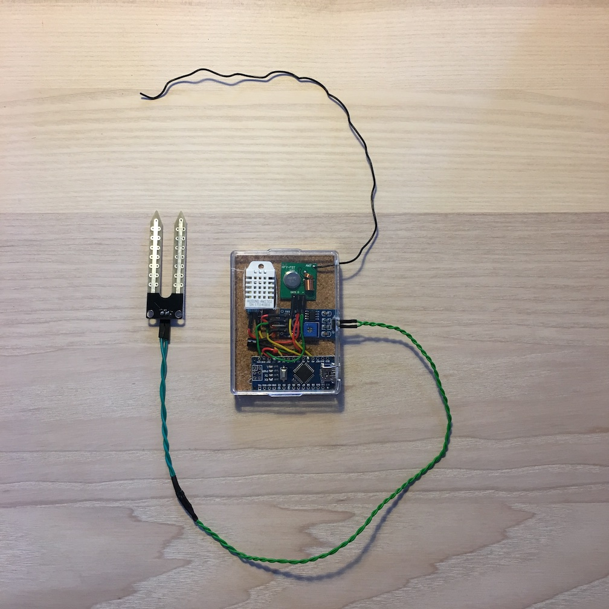
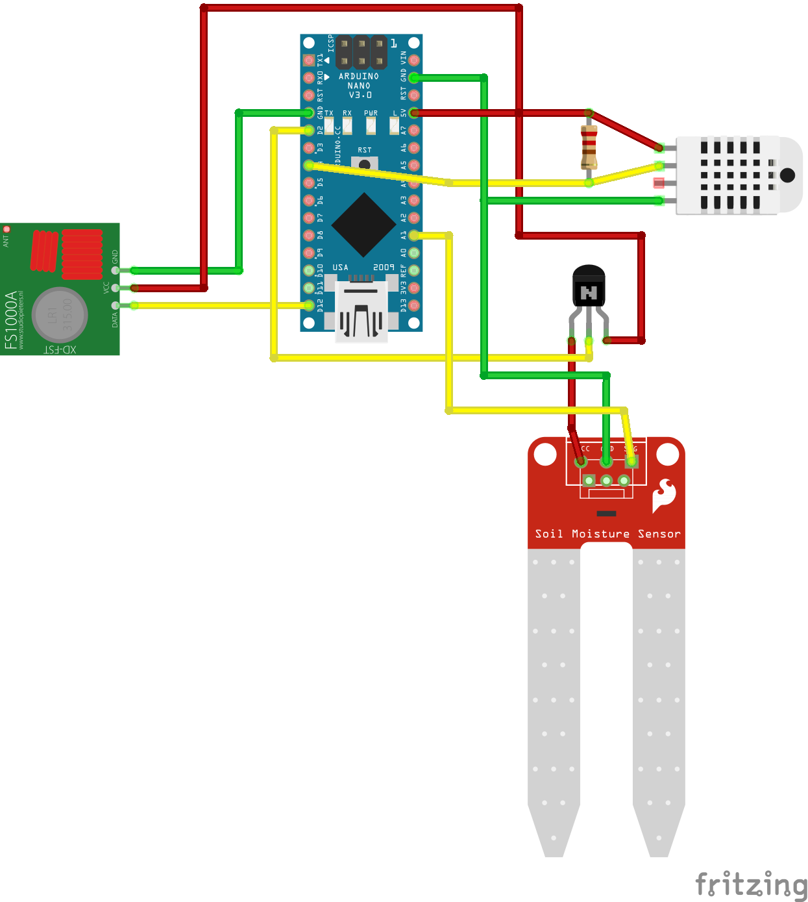

# Weather at Home Client: Temperature, Humidity and Soil Moisture

Get temperature and humidity from DHT22 and moisture from YL69 and send 
via 433MHz interface to the Smart Home Server.  
This project runs on an Arduino Nano. It should run on other Arduinos too.

## Features

- Get 3 minutes temperature average
- Get 3 minutes humidity average
- Optional soil moisture every 30 minutes
- Send data via 433.92MHz transmitter
- Reduces overall power comsumption
- Prevents corrosion of the soil moisture sensor

## Development

Enable verbose logging: set ``MODE`` to ``MODE_DEVELOPMENT``

### Dependencies

Required libraries:

- Adafruit Unified Sensor
- DHT sensor library
- Low-Power

## Deployment

1. Disable verbose logging: set ``MODE`` to ``MODE_PRODUCTION``
1. Flash device

## Hardware

### Parts

- Arduino (Nano, Mini, Uno, ...)
- DHT22 for temperature and humidity
- 220 Ohm resistor
- Optional: YL69 for moisture
- Optional NPN transistor (enable/disable YL69 to prevent corrosion)
- 433MHz transmitter
- Wires
- USB cable USB-A to USB Micro
- Power supply (1A)

### Wiring

[Fritzing Sketch](docs/Arduino-Nano-433MHz-DHT22-YL69_Wiring.fzz)

